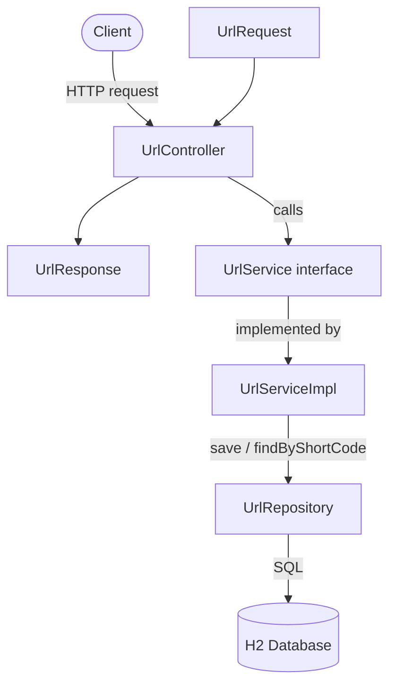

# URL Shortener

A RESTful URL Shortener built with Spring Boot 3.5, using Base62 encoding of database-generated IDs for collision-free short code generation, no random-string collision checks needed.

## Tech Stack
- Java 21 (LTS)
- Spring Boot 3.5 (Web, Data JPA, Validation)
- H2 (in-memory database)
- Lombok
- JUnit 5 + Mockito + MockMvc

## Architecture



**How short codes are generated:** a new `Url` row is saved once to get a database-assigned id, that id is Base62-encoded into a short string (e.g. id `125` → code `"21"`), then the row is updated with that code. This guarantees uniqueness for free, since it's derived from an id the database already guarantees is unique — no random-generation collision retries needed.

## API Endpoints

| Method | Endpoint | Description |
|--------|----------|--------------|
| POST | /api/urls | Create a short URL from a long URL |
| GET | /{shortCode} | Redirect to the original URL (302) |

## Running Locally
```bash
./mvnw spring-boot:run
```
App runs on `http://localhost:8080`. H2 console available at `http://localhost:8080/h2-console` (JDBC URL: `jdbc:h2:mem:tododb` — check your `application.properties` for the exact DB name — user: `sa`, no password).

## Running Tests
```bash
./mvnw test
```
8 tests: 3 service-layer unit tests (Mockito), 4 controller integration tests (MockMvc) including a full create-then-redirect end-to-end test, 1 context load test.

## Example Usage
```bash
curl -i -X POST http://localhost:8080/api/urls \
  -H "Content-Type: application/json" \
  -d '{"originalUrl": "https://www.example.com"}'
# Response includes "shortUrl": "http://localhost:8080/21"

curl -i http://localhost:8080/21
# 302 redirect to https://www.example.com
```